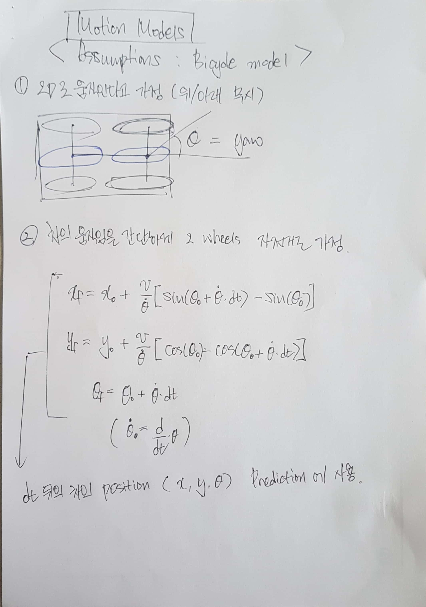
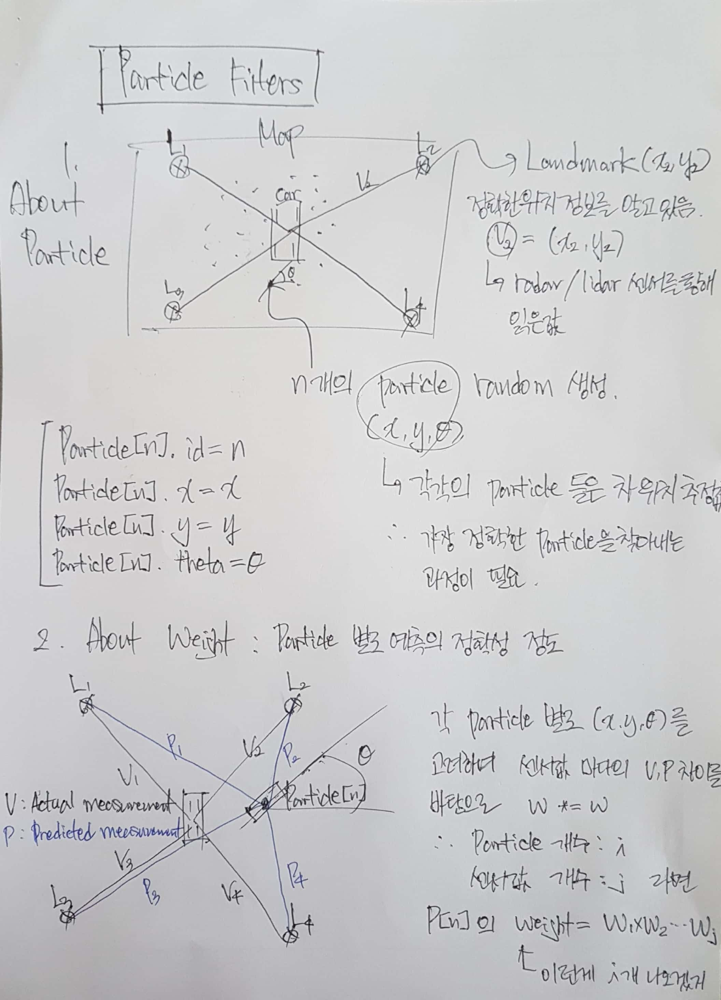
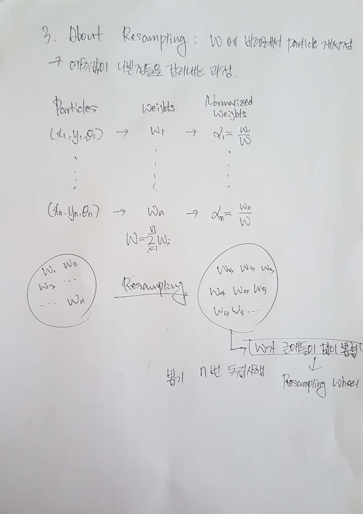
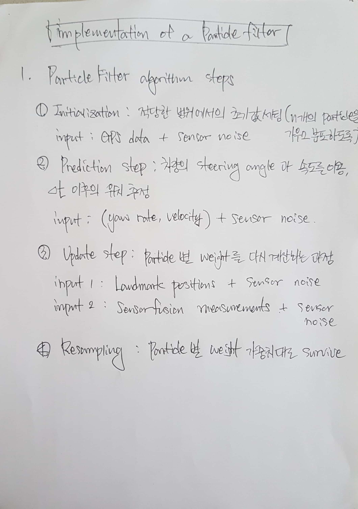
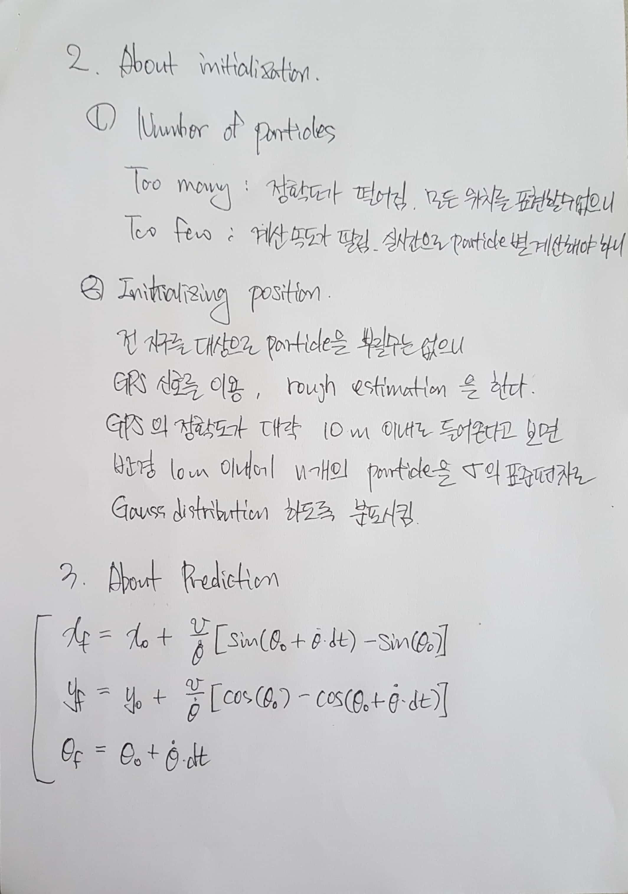
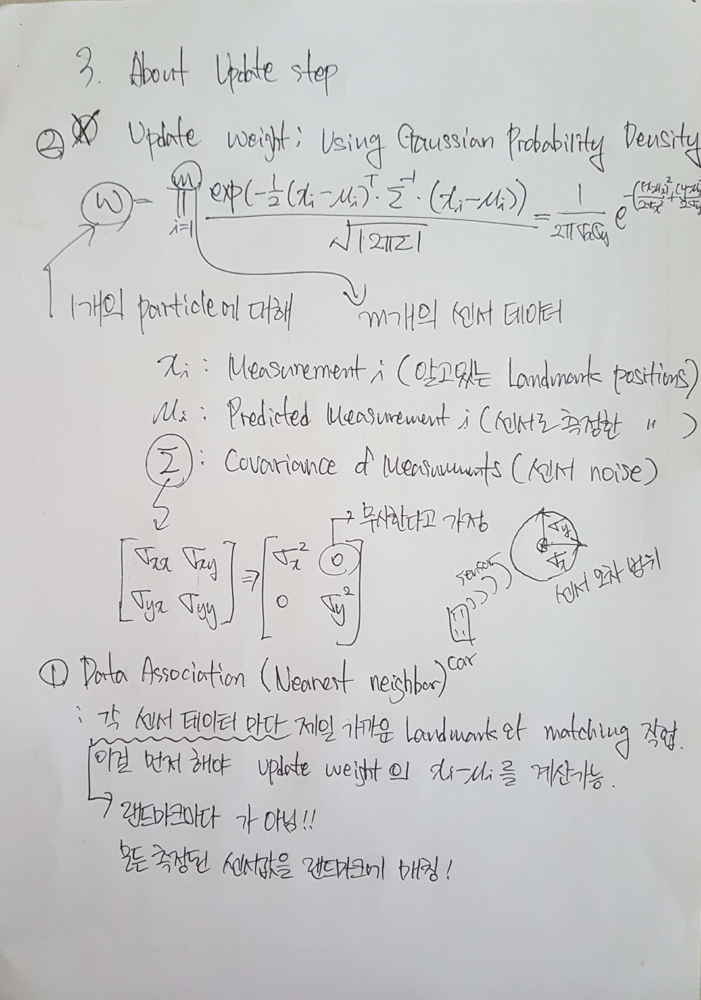
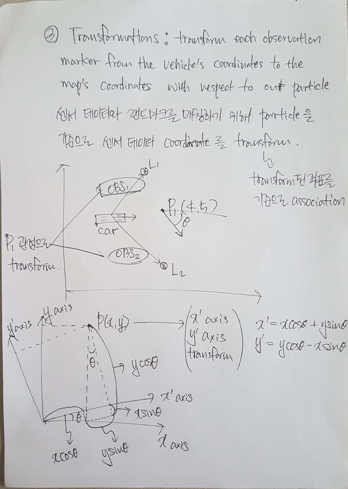

# UDACITY-SELF_DRIVING_CAR_ENGINEER_NANODEGREE_project6.-kidnapped-vehicle


[//]: # (Image References)

[image1-1]: ./images/laser_radar.png "raser and radar characterastics"

[image2-1]: ./images/kalman_filter_1.jpg "About Kalman Filter"
[image2-2]: ./images/kalman_filter_2.jpg "About Kalman Filter"
[image2-3]: ./images/kalman_filter_3.jpg "About Kalman Filter"
[image2-4]: ./images/kalman_filter_4.jpg "About Kalman Filter"
[image2-5]: ./images/kalman_filter_5.jpg "About Kalman Filter"

[image3-1]: ./images/extended_kalman_filter_1.jpg "About Extended Kalman Filter"
[image3-2]: ./images/extended_kalman_filter_2.jpg "About Extended Kalman Filter"
[image3-3]: ./images/extended_kalman_filter_3.jpg "About Extended Kalman Filter"
[image3-4]: ./images/extended_kalman_filter_4.jpg "About Extended Kalman Filter"
[image3-5]: ./images/extended_kalman_filter_5.jpg "About Extended Kalman Filter"
[image3-6]: ./images/extended_kalman_filter_6.jpg "About Extended Kalman Filter"
[image3-7]: ./images/extended_kalman_filter_7.jpg "About Extended Kalman Filter"
[image3-8]: ./images/extended_kalman_filter_8.jpg "About Extended Kalman Filter"
[image3-9]: ./images/extended_kalman_filter_9.jpg "About Extended Kalman Filter"

[image4-1]: ./images/code_flow.png "Code Flow"

[image5-1]: ./images/result.png "Result"


# Introduction

The object of this project is to localize car's position

Before project (Kalman filter) is to detect object's using sensor fusion, and this project is detect my position exactly

by also using sensor fusion

Of coulse it is possible localize my position by using GPS, but its range accuracy is more than 1m

We need at least 10cm accuracy so we need more than just GPS

In this project, I will use GPS for initializing first car's position

after than use sensor fusion for detecting landmarks that already know its position

and finally find car's exact position by using particle filter


# Background Learning

For this project, I had to learn principle of Particle-Filter

### 1. Motion models

- Assumption for bicycle model




### 2. Particle Filters





### 3. Implementation of a Particle Filter







# Content Of This Repo
- ```src``` a directory with the project code
	- ```main.cpp``` : reads in data, calls a function to run the Particle filter, calls a function to calculate Error
    - ```ParticleFilter.cpp``` : describes particle filter functions
    - ```ParticleFilter.h``` : header file for .cpp
    - ```map.h``` : information about landmark position
    - ```json.hpp``` : for using json in main.cpp
    - ```helper_functions.h``` : functions used to in ParticleFilter.cpp


# Summary Of Each File
1. FusionEKF.h


# Results

I have done one simulation and got this result

px,py means position of x,y

vx, vy means calculated velocity of x,y

![alt text][image5-1]


*Test One*

| Input |   MSE   |
| ----- | ------- |
|  px   | 0.1164 |
|  py   | 0.2811 |
|  vx   | 0.4542 |
|  vy   | 0.7827 |


# Conclusion & Discussion

### 1. About total flow of self-driving car

What do we need to make self driving car?

Firstly, we may need detect surroundings like we see when driving

For that, I learned computer vision, deep learning, sensor fusion at before projects

Secondly, we need to know where am I exactly, in the range of 10cm

This project is at exactly this point

This, particle filter is for localization of my exact position

Thirdly, we need to decide how to react like go straight, turn left, change lanes ...

Next project will cover this subjects


