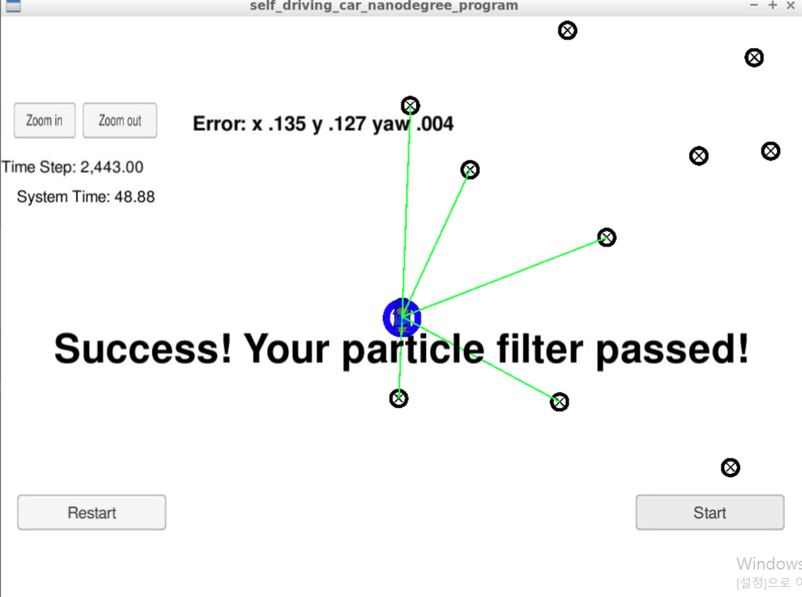

# SELF DRIVING CAR NANODEGREE
# project6. Kidnapped Vehicle

## 1. Abstraction

The object of this project is to localize car's position

Before project (Kalman filter) is to detect object's using sensor fusion, and this project is detect my position exactly

by also using sensor fusion

Of coulse it is possible localize my position by using GPS, but its range accuracy is more than 1m

We need at least 10cm accuracy so we need more than just GPS

In this project, I will use GPS for initializing first car's position

after than use sensor fusion for detecting landmarks that already know its position

and finally find car's exact position by using particle filter


## 2. Related Study


#### 1) Motion models

① Assumption for bicycle model

② (x,y,theta) prediction


#### 2) Particle Filters

① About landmarks

② Role of weights

③ Resampling


#### 3) Implementation of a Particle Filter

① Algorithm steps : Initiation → Prediction → Update → Resampling

② About initiation : Meaning of number of particles, Initiation position

③ About prediction : Motion models

④ About update step : Data Association, Update weights, Transformations

## 3. Details

#### 1) Content Of This Repo

- ```src``` a directory with the project code
    - ```main.cpp``` : reads in data, calls a function to run the Particle filter, calls a function to calculate Error
    - ```ParticleFilter.cpp``` : describes particle filter functions
    - ```ParticleFilter.h``` : header file for .cpp
    - ```map.h``` : information about landmark position
    - ```json.hpp``` : for using json in main.cpp
    - ```helper_functions.h``` : functions used to in ParticleFilter.cpp

#### 2) Code

① main.cpp

```c++
#include <math.h>
#include <uWS/uWS.h>
#include <iostream>
#include <string>
#include "json.hpp"
#include "particle_filter.h"

using nlohmann::json;
using std::string;
using std::vector;

string hasData(string s) {
  auto found_null = s.find("null");
  auto b1 = s.find_first_of("[");
  auto b2 = s.find_first_of("]");
  if (found_null != string::npos) {
    return "";
  } else if (b1 != string::npos && b2 != string::npos) {
    return s.substr(b1, b2 - b1 + 1);
  }
  return "";
}

int main() {
  uWS::Hub h;

  double delta_t = 0.1;  // Time elapsed between measurements [sec]
  double sensor_range = 50;  // Sensor range [m]

  // GPS measurement uncertainty [x [m], y [m], theta [rad]]
  double sigma_pos [3] = {0.3, 0.3, 0.01};
  // Landmark measurement uncertainty [x [m], y [m]]
  double sigma_landmark [2] = {0.3, 0.3};

  Map map;
  if (!read_map_data("../data/map_data.txt", map)) {
    std::cout << "Error: Could not open map file" << std::endl;
    return -1;
  }

  ParticleFilter pf;

  h.onMessage([&pf,&map,&delta_t,&sensor_range,&sigma_pos,&sigma_landmark]
              (uWS::WebSocket<uWS::SERVER> ws, char *data, size_t length, 
               uWS::OpCode opCode) {

    if (length && length > 2 && data[0] == '4' && data[1] == '2') {
      auto s = hasData(string(data));

      if (s != "") {
        auto j = json::parse(s);

        string event = j[0].get<string>();
        
        if (event == "telemetry") {
          // j[1] is the data JSON object
          if (!pf.initialized()) {

            double sense_x = std::stod(j[1]["sense_x"].get<string>());
            double sense_y = std::stod(j[1]["sense_y"].get<string>());
            double sense_theta = std::stod(j[1]["sense_theta"].get<string>());

            pf.init(sense_x, sense_y, sense_theta, sigma_pos);
          } else {

            double previous_velocity = std::stod(j[1]["previous_velocity"].get<string>());
            double previous_yawrate = std::stod(j[1]["previous_yawrate"].get<string>());

            pf.prediction(delta_t, sigma_pos, previous_velocity, previous_yawrate);
          }

          vector<LandmarkObs> noisy_observations;
          string sense_observations_x = j[1]["sense_observations_x"];
          string sense_observations_y = j[1]["sense_observations_y"];

          vector<float> x_sense;
          std::istringstream iss_x(sense_observations_x);

          std::copy(std::istream_iterator<float>(iss_x),
          std::istream_iterator<float>(),
          std::back_inserter(x_sense));

          vector<float> y_sense;
          std::istringstream iss_y(sense_observations_y);

          std::copy(std::istream_iterator<float>(iss_y),
          std::istream_iterator<float>(),
          std::back_inserter(y_sense));

          for (unsigned int i = 0; i < x_sense.size(); ++i) {
            LandmarkObs obs;
            obs.x = x_sense[i];
            obs.y = y_sense[i];
            noisy_observations.push_back(obs);
          }

          pf.updateWeights(sensor_range, sigma_landmark, noisy_observations, map);
          pf.resample();
          
          vector<Particle> particles = pf.particles;
          
          int num_particles = particles.size();
          double highest_weight = -1.0;
          Particle best_particle;
          double weight_sum = 0.0;
          
          for (int i = 0; i < num_particles; ++i) {
            if (particles[i].weight > highest_weight) {
              highest_weight = particles[i].weight;
              best_particle = particles[i];
            }

            weight_sum += particles[i].weight;
          }

          std::cout << "highest w " << highest_weight << std::endl;
          std::cout << "average w " << weight_sum/num_particles << std::endl;

          json msgJson;
          msgJson["best_particle_x"] = best_particle.x;
          msgJson["best_particle_y"] = best_particle.y;
          msgJson["best_particle_theta"] = best_particle.theta;

          msgJson["best_particle_associations"] = pf.getAssociations(best_particle);
          msgJson["best_particle_sense_x"] = pf.getSenseCoord(best_particle, "X");
          msgJson["best_particle_sense_y"] = pf.getSenseCoord(best_particle, "Y");

          auto msg = "42[\"best_particle\"," + msgJson.dump() + "]";

          ws.send(msg.data(), msg.length(), uWS::OpCode::TEXT);
        }
      } else {
        string msg = "42[\"manual\",{}]";
        ws.send(msg.data(), msg.length(), uWS::OpCode::TEXT);
      }
    }
  });

  h.onConnection([&h](uWS::WebSocket<uWS::SERVER> ws, uWS::HttpRequest req) {
    std::cout << "Connected!!!" << std::endl;
  });

  h.onDisconnection([&h](uWS::WebSocket<uWS::SERVER> ws, int code, 
                         char *message, size_t length) {
    ws.close();
    std::cout << "Disconnected" << std::endl;
  });

  int port = 4567;
  if (h.listen(port)) {
    std::cout << "Listening to port " << port << std::endl;
  } else {
    std::cerr << "Failed to listen to port" << std::endl;
    return -1;
  }
  
  h.run();
}
```

② particle

###### ParticleFilter.h

```c++

#ifndef PARTICLE_FILTER_H_
#define PARTICLE_FILTER_H_

#include <string>
#include <vector>
#include "helper_functions.h"
#include <random>

struct Particle {
  int id;
  double x;
  double y;
  double theta;
  double weight;
  std::vector<int> associations;
  std::vector<double> sense_x;
  std::vector<double> sense_y;
};

class ParticleFilter {  
 public:

  ParticleFilter() : num_particles(0), is_initialized(false) {}

  ~ParticleFilter() {}

  void init(double x, double y, double theta, double std[]);

  void prediction(double delta_t, double std_pos[], double velocity, 
                  double yaw_rate);
  
  void dataAssociation(std::vector<LandmarkObs> predicted, 
                       std::vector<LandmarkObs>& observations);

  void updateWeights(double sensor_range, double std_landmark[], 
                     const std::vector<LandmarkObs> &observations,
                     const Map &map_landmarks);
  
  void resample();

  void SetAssociations(Particle& particle, const std::vector<int>& associations,
                       const std::vector<double>& sense_x, 
                       const std::vector<double>& sense_y);

  const bool initialized() const {
    return is_initialized;
  }

  std::string getAssociations(Particle best);
  std::string getSenseCoord(Particle best, std::string coord);

  std::vector<Particle> particles;

 private:
  int num_particles; 
  
  bool is_initialized;

  std::vector<double> weights; 

  std::default_random_engine gen;
};

#endif
```

###### ParticleFilter.cpp

```c++
#include "particle_filter.h"

#include <math.h>
#include <algorithm>
#include <iostream>
#include <iterator>
#include <numeric>
#include <random>
#include <string>
#include <vector>

#include "helper_functions.h"

using std::string;
using std::vector;
using namespace std;

void ParticleFilter::init(double x, double y, double theta, double std[]) {
  
  if(is_initialized){
    return;
  }

  num_particles = 20;  
  
  // Set standard deviation of GPS data
  double std_dev_x = std[0];
  double std_dev_y = std[1];
  double std_dev_theta = std[2];
  
  // Set Gaussian distribution of GPS data
  normal_distribution<double> dist_x(x, std_dev_x);
  normal_distribution<double> dist_y(y, std_dev_y);
  normal_distribution<double> dist_theta(theta, std_dev_theta);
  
  for(int i=0; i < num_particles; i++){
    Particle particle;
    particle.id = i;
    particle.x = dist_x(gen);
    particle.y = dist_y(gen);
    particle.theta = dist_theta(gen);
    particle.weight = 1.0;
    
    particles.push_back(particle);
    
    is_initialized = true;
  }

}


void ParticleFilter::prediction(double delta_t, double std_pos[], 
                                double velocity, double yaw_rate) {

  double std_dev_x = std_pos[0];
  double std_dev_y = std_pos[1];
  double std_dev_theta = std_pos[2];

  normal_distribution<double> dist_x(0, std_dev_x);
  normal_distribution<double> dist_y(0, std_dev_y);
  normal_distribution<double> dist_theta(0, std_dev_theta);

  for(int i = 0; i < num_particles; i++){
    double theta = particles[i].theta;

    if( fabs(yaw_rate) < 0.000001 ){
      particles[i].x += velocity * delta_t * cos( theta );
      particles[i].y += velocity * delta_t * sin( theta );
    }

    else{
      particles[i].x += velocity / yaw_rate * ( sin( theta + yaw_rate * delta_t ) - sin( theta ) );
      particles[i].y += velocity / yaw_rate * ( cos( theta ) - cos( theta + yaw_rate * delta_t ) );
      particles[i].theta += yaw_rate * delta_t;
    
    particles[i].x += dist_x(gen);
    particles[i].y += dist_y(gen);
    particles[i].theta += dist_theta(gen);
    }
  }
}

void ParticleFilter::dataAssociation (vector<LandmarkObs> predicted, vector<LandmarkObs>& observations) {

  int number_landmarks = predicted.size();
  int number_sensor_data = observations.size();

  for (int i = 0; i < number_sensor_data; i++){

    double min_distance = numeric_limits<double>::max();
    
    int map_id;
    
    for (int j = 0; j < number_landmarks; j++){
      
      double distance = sqrt(pow(observations[i].x - predicted[j].x,2) + pow(observations[i].y - predicted[j].y ,2));
      
      if(distance < min_distance){
        min_distance = distance;
        map_id = predicted[j].id;
      }  
    }
    observations[i].id = map_id;
  }    
}

void ParticleFilter::updateWeights(double sensor_range, double std_landmark[], 
                                   const vector<LandmarkObs> &observations, 
                                   const Map &map_landmarks) {

  double std_dev_range = std_landmark[0];
  double std_dev_bearing = std_landmark[1];
  
  for (int i = 0; i < num_particles; i++){

    double x = particles[i].x;
    double y = particles[i].y;
    double theta = particles[i].theta;
    
    vector<LandmarkObs> in_sensor_range_landmarks;
    
    for (unsigned int j = 0; j < map_landmarks.landmark_list.size(); j++){

      float landmark_x = map_landmarks.landmark_list[j].x_f;
      float landmark_y = map_landmarks.landmark_list[j].y_f;
      int landmark_id = map_landmarks.landmark_list[j].id_i;

      double distance_x = x - landmark_x;
      double distance_y = y - landmark_y;
      double distance_land_between_particle = sqrt(pow(distance_x,2) + pow(distance_y,2));

      if(distance_land_between_particle < sensor_range){
        
        in_sensor_range_landmarks.push_back(LandmarkObs{landmark_id, landmark_x, landmark_y});
        
      }     
    }
    
    for (unsigned int j = 0; j < observations.size() ; j++){
     
      double transformed_x = cos(theta)*observations[j].x - sin(theta)*observations[j].y + x;
      double transformed_y = sin(theta)*observations[j].x + cos(theta)*observations[j].y + y;
      transformed_observations.push_back(LandmarkObs{ observations[j].id, transformed_x, transformed_y });      
      
    }
    
    dataAssociation(in_sensor_range_landmarks, transformed_observations);

    particles[i].weight = 1.0;
    
    for (unsigned int j = 0; j < transformed_observations.size(); j++){
      
      double transformed_sensor_x = transformed_observations[j].x;
      double transformed_sensor_y = transformed_observations[j].y;
      int landmark_sensor_matched_id = transformed_observations[j].id;
      
      double landmark_sensor_matched_x;
      double landmark_sensor_matched_y;
      
      int k = 0;
      int number_landmarks = in_sensor_range_landmarks.size();
      bool found = false;
      
      while( !found && k < number_landmarks) {
        
        if ( in_sensor_range_landmarks[k].id == landmark_sensor_matched_id) {
          
          found = true;
          landmark_sensor_matched_x = in_sensor_range_landmarks[k].x;
          landmark_sensor_matched_y = in_sensor_range_landmarks[k].y;
        }
        k++;
      }
      
      double dx = transformed_sensor_x - landmark_sensor_matched_x;
      double dy = transformed_sensor_y - landmark_sensor_matched_y;
      
      double weight = ( 1/(2*M_PI*std_dev_range*std_dev_bearing))
                       * exp( -( dx*dx/(2*std_dev_range*std_dev_range)
                       + (dy*dy/(2*std_dev_bearing*std_dev_bearing)) ) );
      
      if ( weight == 0 ) {
        particles[i].weight *= 0.000001; 
      }
      else {
        particles[i].weight *= weight;
      }  
    }
  }
}

void ParticleFilter::resample() {

  vector<double> weights;
  double max_weight = numeric_limits<double>::min();
  
  for ( int i = 0; i < num_particles; i++) {

    weights.push_back(particles[i].weight);

    if ( particles[i].weight > max_weight ) {
      max_weight = particles[i].weight; 
    }
  }

  uniform_real_distribution<double> dist_double(0.0, max_weight);
  uniform_int_distribution<int> dist_int(0, num_particles-1);
  
  int index = dist_int(gen);
  
  double beta = 0.0;

  vector<Particle> resampled_particles;
  for ( int i = 0; i < num_particles; i++) {
    beta += dist_double(gen) * 2.0;
    while ( beta > weights[index] ) {
      beta -= weights[index];
      index = (index + 1) % num_particles;
    }
    resampled_particles.push_back(particles[index]);  
  }
  particles = resampled_particles;
}

void ParticleFilter::SetAssociations(Particle& particle, 
                                     const vector<int>& associations, 
                                     const vector<double>& sense_x, 
                                     const vector<double>& sense_y) {

  particle.associations= associations;
  particle.sense_x = sense_x;
  particle.sense_y = sense_y;
}

string ParticleFilter::getAssociations(Particle best) {
  vector<int> v = best.associations;
  std::stringstream ss;
  copy(v.begin(), v.end(), std::ostream_iterator<int>(ss, " "));
  string s = ss.str();
  s = s.substr(0, s.length()-1);  // get rid of the trailing space
  return s;
}

string ParticleFilter::getSenseCoord(Particle best, string coord) {
  vector<double> v;

  if (coord == "X") {
    v = best.sense_x;
  } else {
    v = best.sense_y;
  }

  std::stringstream ss;
  copy(v.begin(), v.end(), std::ostream_iterator<float>(ss, " "));
  string s = ss.str();
  s = s.substr(0, s.length()-1);  // get rid of the trailing space
  return s;
}
```


## 4. Results




## 5. Discussion

#### 1) About total flow of self-driving car

What do we need to make self driving car?

Firstly, we may need detect surroundings like we see when driving

For that, I learned computer vision, deep learning, sensor fusion at before projects

Secondly, we need to know where am I exactly, in the range of 10cm

This project is at exactly this point

This, particle filter is for localization of my exact position

Thirdly, we need to decide how to react like go straight, turn left, change lanes ...

Next project will cover this subjects


